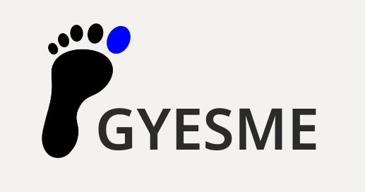

# GYESME

**Minimal by default. Modular by design. Free to run on the Linux distribution you choose.**

GYESME is a modern, modular GNOME fork that treats minimalism as a default rather than a constraint. It reintroduces optional functionality that is disabled or removed upstream, preserves established Linux interaction patterns, and minimizes hard dependencies on systemd to maintain portability across Linux distributions.

---

## What is GYESME?

GYESME provides a flexible, modular desktop experience:

- **Minimalist by default:** Keep your desktop clean and distraction-free.  
- **Optional features:** Enable only the features you need — no bloat.  
- **Linux traditions:** Middle-click paste, modularity, and respect for established workflows are preserved.  
- **Systemd-independent:** Use GYESME on the Linux distribution of your choice.

---

## Why GYESME?

GNOME provides a clean, modern desktop environment with a strong emphasis on simplicity and consistency. However, its design philosophy prioritizes a tightly controlled user experience, often at the expense of configurability, traditional Unix behaviors, and alternative workflows. Over time, this has led to the removal or hard-coding of features that many Linux users and developers consider fundamental.

GYESME addresses this by treating GNOME not as a fixed product, but as a flexible platform. Features that are disabled or removed upstream are re-exposed as optional components, allowing behavior to be extended or altered without fragmenting the core user experience.

From a systems perspective, GYESME also aims to reduce unnecessary coupling to specific subsystems such as systemd. By avoiding hard dependencies where possible and favoring well-defined interfaces, the project seeks to remain compatible with a wider range of Linux environments, init systems, and distributions.

In short, GYESME reconciles GNOME’s modern design with traditional Unix principles: composability over prescription, opt-in complexity over enforced minimalism, and user control over opaque defaults.

---

## How GYESME Differs from GNOME Extensions

While GNOME extensions provide a convenient way to tweak the desktop, they operate on top of a system designed with fixed defaults and limited modularity. Extensions often rely on fragile APIs, can conflict with each other, and may break with each new GNOME release. They are add-ons rather than integrated solutions, and most cannot restore functionality that has been removed upstream or re-architect core behavior.

GYESME treats modularity as a core principle, enabling optional features at the architectural level rather than layering them on top. Features that would normally require separate extensions can be enabled or disabled cleanly, with minimal risk of conflicts, and without compromising the minimal default experience.

In short, GYESME provides a **cohesive, maintainable, and distribution-independent foundation** that integrates optional power features, preserves Linux conventions, and ensures long-term stability across GNOME releases.

---

## Non-Goals

- GYESME is not intended to “fix” GNOME or compete with upstream GNOME development.  
- It does not reintroduce every legacy feature or recreate old desktop paradigms.  
- Minimalism remains a core value; feature growth is intentional and conservative.  
- Visual customization is only pursued when functional or architectural.  
- GYESME does not impose a universal workflow; users who prefer upstream GNOME are already served.

---

## Contributor Philosophy

- Contributions should improve modularity, restore optional functionality, or reduce unnecessary coupling.  
- Features should be opt-in; disabling a feature should not cause regressions.  
- Solutions should coexist with upstream GNOME development where possible.  
- Architectural clarity and documentation are as important as code quality.

---

## On systemd Independence

- GYESME does not oppose systemd or remove systemd support where present.  
- The goal is to **avoid unnecessary hard dependencies** on systemd-specific functionality.  
- Optional abstraction layers allow the desktop to function on alternative init systems.  
- This approach improves portability, testability, and long-term resilience.

---

## Core Features

### Minimalist by Default
Clean interface, distraction-free, with optional features disabled by default.

### Optional Power Features
Workspace tweaks, overview enhancements, panel and shortcut customizations.

### Linux Traditions Preserved
Middle-click paste, X11 behavior, keyboard-centric workflows remain intact.

### Systemd Independence
Runs on alternative init systems, ensuring portability and user control.

---

## Roadmap (24 Months)

GYESME’s development is structured around **6 milestones**:

| Milestone | Goals |
|-----------|-------|
| **M1 – Foundation & Documentation (Months 1–3)** | Set up repo, README, CONTRIBUTING.md, and document existing GNOME extensions. |
| **M2 – First Modular Features (Months 4–6)** | Add initial optional modules: “Hello World” feature, Dash-to-Dock, workspace overview, window shortcuts. |
| **M3 – Linux Conventions & Core Features (Months 7–9)** | Ensure middle-click paste consistency, optional workspace naming, notification enhancements. |
| **M4 – Advanced Modular Features (Months 10–12)** | Quick Settings enhancements, Power User System Menu. |
| **M5 – Testing & Packaging (Months 13–15)** | Automated testing and packaging for all modules. |
| **M6 – Cross-Distro & Community (Months 16–24)** | Test modules across multiple distributions, validate systemd independence, grow contributor community. |

---

## How to Contribute

Follow this workflow:

- [ ] Pick an issue from the [Project Board](Projects) → **Backlog** column.  
- [ ] Move it to **To Do** / **In Progress** as you start working.  
- [ ] Submit a **Pull Request (PR)** with your changes.  
- [ ] Move the card to **Review / PR** for review.  
- [ ] Merge the PR and move to **Done** when completed.

**Labels guide:**

- `good first issue` → Beginner-friendly tasks  
- `enhancement` → Optional feature or module  
- `modular-feature` → Modular, opt-in feature  
- `testing` → Verification or automated tests  
- `research` → Documentation or investigation  
- `UX` → User experience enhancements  

---

## Labels Reference

To help contributors correctly categorize their work:

| Label | Purpose | Suggested Use |
|-------|---------|---------------|
| `good first issue` | Beginner-friendly tasks | Small tasks suitable for first-time contributors |
| `enhancement` | Optional feature or module | Any improvement or addition to existing functionality |
| `modular-feature` | Modular, opt-in feature | Features that can be enabled or disabled without affecting the default experience |
| `testing` | Verification or automated tests | Testing, QA, or bug verification work |
| `research` | Documentation or investigation | Tasks involving analysis, documentation, or exploration |
| `UX` | User experience enhancements | Interface improvements, workflow refinements |

> **Tip:** Select the label(s) that most accurately describe your work. Use multiple labels if a task spans categories (e.g., `enhancement` + `UX`).

---

## Communication

- Join discussions via **[Issues](Issues)** or **[Pull Requests](Pull Requests)**.  
- Participate in **Project Board planning and updates**.  
- Future community forum (TBD) for roadmap feedback and design discussions.

---

## License

GYESME is **licensed under GPL-3.0**, respecting the spirit of Linux and free software.

---

> **Tip for contributors:** Work on feature branches, keep changes modular, and preserve the clean default experience.
